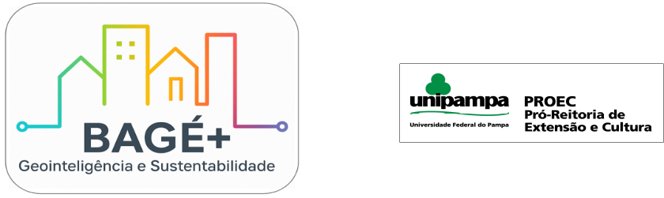

# GeoViasOS — GeoVias Bagé-RS

**Acesse o site:** https://alexandrogschafer.github.io/GeoViasOS/

Repositório do **GeoVias Bagé-RS**, um sistema integrado de informações sobre vias e pavimentação urbana de Bagé/RS.  
Projeto desenvolvido no âmbito da **UNIPAMPA**, com apoio do **PROEXT/PROEC**, integrando dados oficiais, colaborativos, levantamentos de campo e imagens de satélite.

  

---

## Tecnologias

- **MkDocs** (gerador estático)
- Tema **Windmill** (`mkdocs-windmill`)
- CSS customizado em `docs/css/custom.css`
- Gráficos/Mapas interativos embarcados via **HTML** (`docs/embeds/...`)

---

## Licenças e créditos

Código: MIT (arquivo LICENSE).

Textos e imagens: CC BY 4.0 (arquivo LICENSE-CC-BY).

Dados: se houver derivados do OpenStreetMap, a base está sob ODbL 1.0 e deve incluir o crédito “© OpenStreetMap contributors” (arquivo DATA_LICENSE).

Logos (BAGÉ+, UNIPAMPA, PROEC): todos os direitos reservados.

Créditos detalhados em ATTRIBUTION.md.

---

## Agradecimentos

Projeto realizado na Universidade Federal do Pampa (UNIPAMPA), com apoio do PROEXT/PROEC, no contexto da iniciativa BAGÉ+.

## Contato

Mantido por: Alexandro G. Schafer

Repositório: https://github.com/Alexandrogschafer/GeoViasOS
