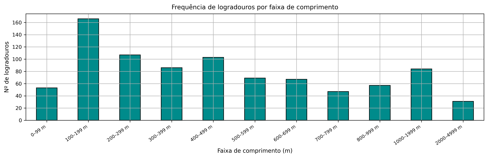
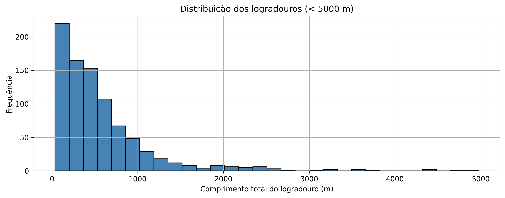
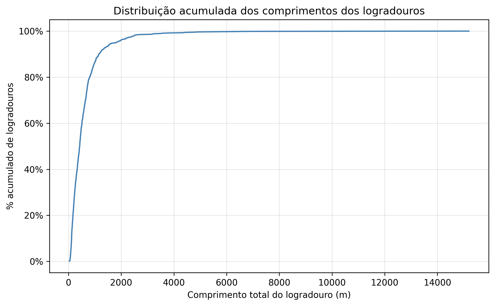
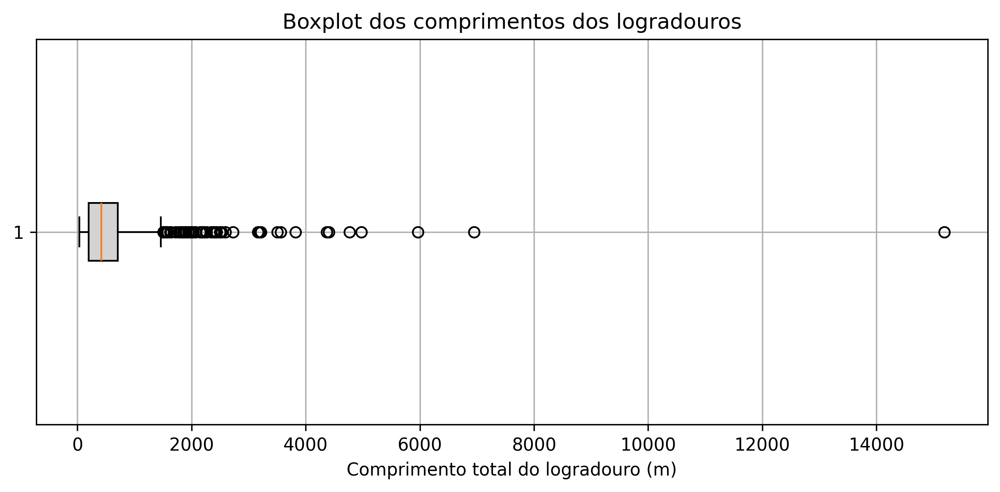
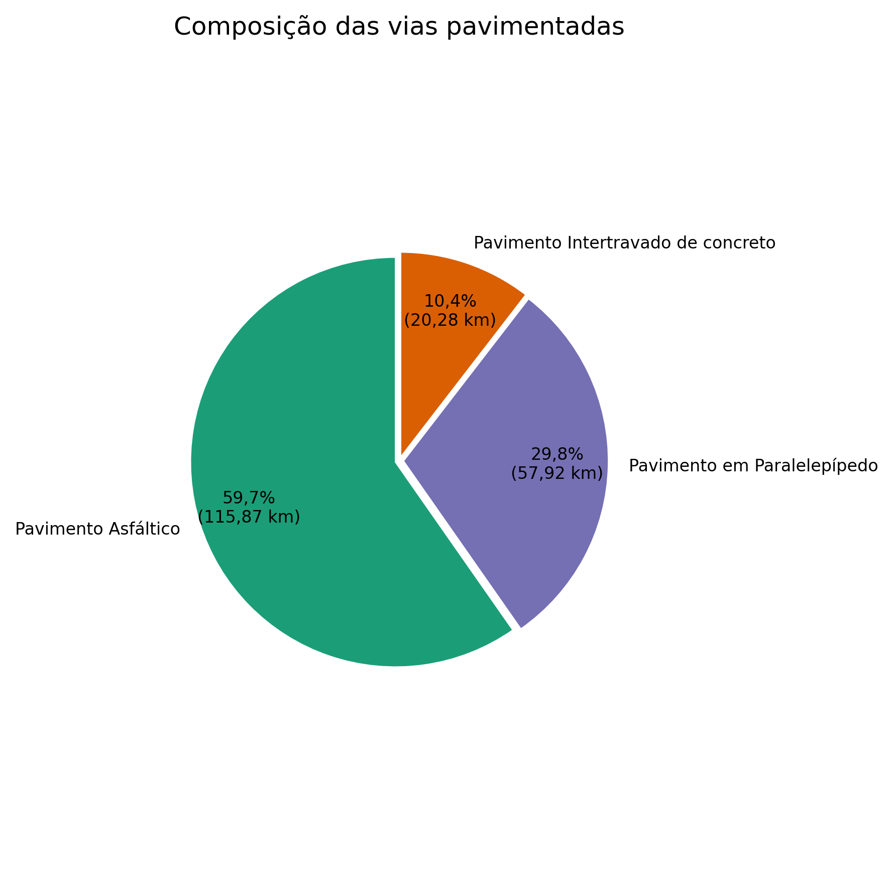
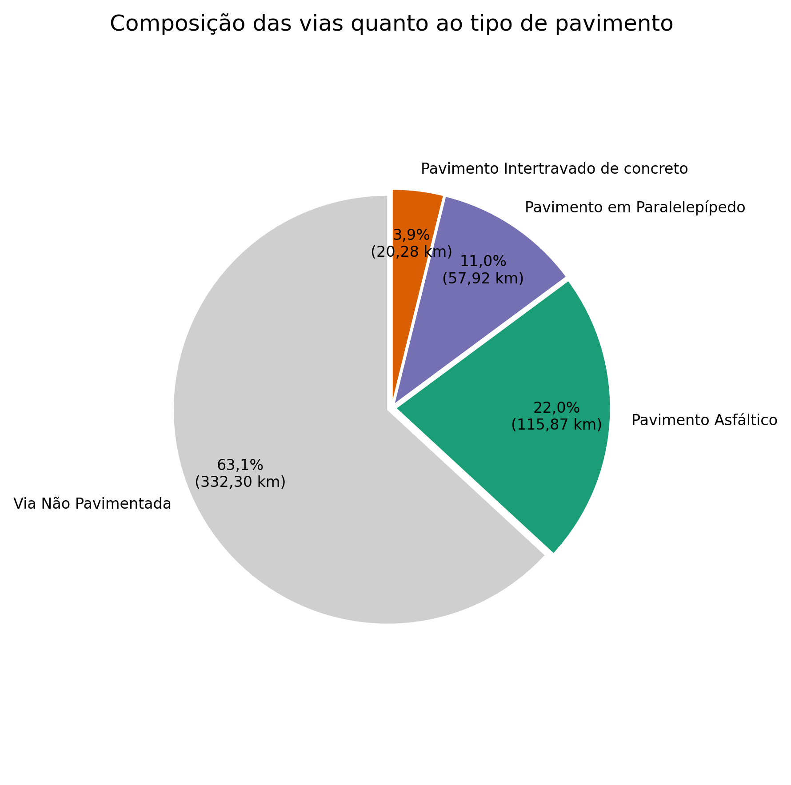
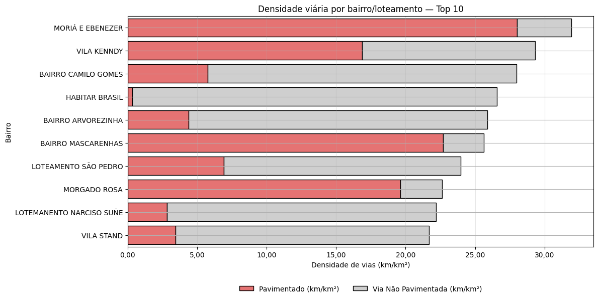
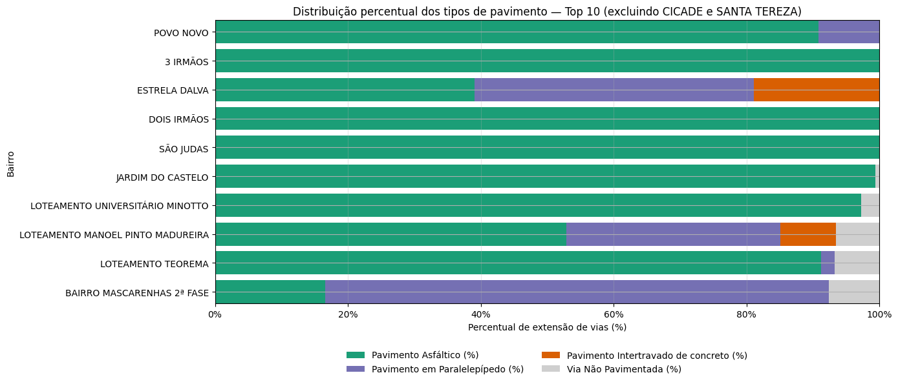
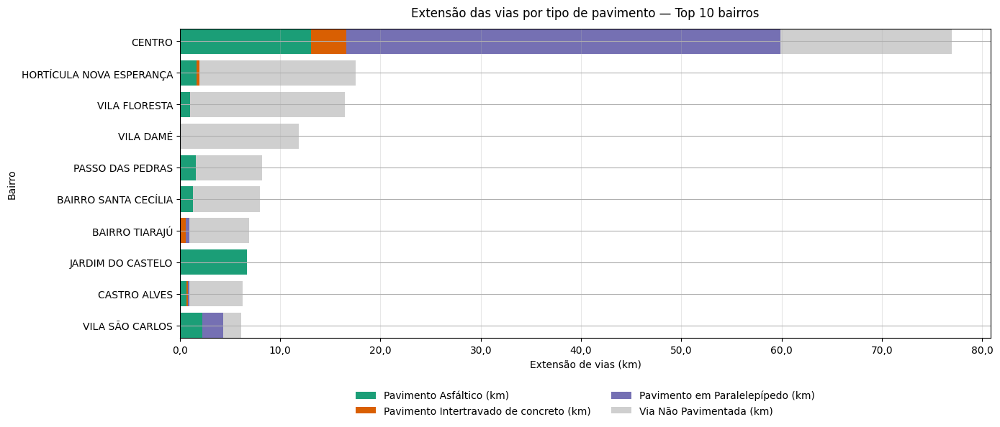

# 4. Resultados

A aplicação da metodologia resultou em uma base viária atualizada e padronizada para a área urbana de Bagé-RS. Com esse insumo, foram elaborados indicadores sintéticos e visualizações que caracterizam o comprimento dos logradouros, a composição do pavimento e os principais rankings por bairro.

## 4.1 Distribuição dos comprimentos dos logradouros

A distribuição dos comprimentos evidencia predominância de logradouros curtos, com maior frequência nas faixas de 100–199 m, 200–299 m e 400–499 m (Figura 1). Considerando exclusivamente trechos inferiores a 5.000 m, verifica-se redução monotônica da frequência à medida que o comprimento aumenta, permanecendo a maior parte dos logradouros abaixo de 1 km (Figura 2).

{width="60%" .center}

{width="60%" .center}

## 4.2 Distribuição acumulada

A curva acumulada confirma a estrutura fragmentada da malha: mais de 80% dos logradouros possuem menos de 500 m e aproximadamente 95% estão abaixo de 1 km (Figura 3).

{width="40%" .center}

## 4.3 Boxplot dos comprimentos

O resumo estatístico por boxplot indica mediana em torno de 300–400 m e a presença de poucos trechos muito longos (> 5 km), associados a eixos estruturantes e conexões interbairros (Figura 4).

{width="40%" .center}

## 4.4 Composição por tipo de pavimento

No conjunto das vias pavimentadas, prevalece o pavimento asfáltico (~59,7%; 115,87 km), seguido por paralelepípedo (~29,8%; 57,92 km) e intertravado de concreto (~10,4%; 20,28 km) (Figura 5). Na rede total, a participação de vias não pavimentadas é majoritária (~63,1%; 332,30 km), ao passo que as pavimentadas somam ~36,9% distribuídas entre asfalto (~22,0%; 115,87 km), paralelepípedo (~11,0%; 57,92 km) e intertravado (~3,9%; 20,28 km) (Figura 6).

{width="60%" .center}

{width="40%" .center}

## 4.5 Resultados por bairro — densidade viária e extensão

Entre os bairros/loteamentos com maiores densidades viárias (km/km²) destacam-se Moriá e Ebenezer e Vila Kenndy. Em parte deles, a elevada densidade associa-se a proporção substantiva de vias pavimentadas; em outros, verifica-se predominância de não pavimentadas, como em Habitar Brasil, Arvorezinha, Camilo Gomes, São Pedro, Narciso Suñé e Vila Stand (Figura 7). No ranking de percentual de pavimentação, sobressaem Povo Novo, 3 Irmãos, Dois Irmãos, São Judas, Jardim do Castelo e Teorema, com cobertura próxima de integral e predomínio do asfalto; observam-se composições mistas em Estrela Dalva (paralelepípedo e intertravado) e em Mascarenhas 2ª Fase (paralelepípedo), além de Universitário Minotto e Manoel Pinto Madureira (Figura 8). Em termos de extensão total, o Centro lidera com ampla quilometragem e participação expressiva de paralelepípedo, seguido por bairros com grande estoque de vias não pavimentadas, como Hortícula Nova Esperança, Vila Floresta e Vila Damé; casos como Jardim do Castelo, Castro Alves e Vila São Carlos apresentam perfil misto (Figura 9).

{width="60%" .center}

{width="60%" .center}

{width="60%" .center}

## 4.6 Resultados por bairro — menores densidades

O grupo com menores densidades é formado, entre outros, por Loteamento Hidráulica, Loteamento Waldemar Mendonça e Balança Municipal, predominando vias não pavimentadas. Também figuram São Judas e 3 Irmãos, que, embora com densidade total reduzida, apresentam componente pavimentado visível. Com valores ainda baixos em relação ao conjunto municipal, completam a lista Vila Santa Ana, Santa Terezinha, Vila Azevedo, Higienópolis e Sol Nascente.

---

Visualizações completas — gráficos e mapas interativos  
Os gráficos e mapas interativos, com os dados de todas as vias e de todos os bairros (não apenas os Top 10), podem ser acessados pelo menu/barra lateral do site. As seções de Gráficos e Mapas permitem explorar, aplicar zoom, consultar tooltips com métricas por trecho/bairro e, quando disponível, realizar o download das visualizações.

---

Nota metodológica — recorte por bairro  
Todos os cálculos por bairro foram realizados com base na delimitação oficial de bairros disponibilizada pela Prefeitura Municipal de Bagé (SIG Territorial). Dessa forma, comprimentos, densidades e percentuais refletem exclusivamente o conteúdo desses polígonos. Como trechos viários podem cruzar limites de bairro, e considerando possíveis atualizações de limites, obras em andamento ou divergências cadastrais, os valores apresentados podem não corresponder exatamente ao verificado em campo. Pequenas diferenças também podem decorrer de tolerâncias de geoprocessamento, cortes na fronteira e arredondamentos.

