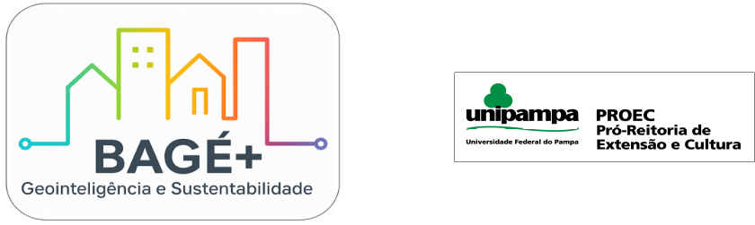

# Sobre o GeoVias Bagé-RS

O **GeoVias Bagé-RS** é um sistema integrado de informações sobre vias e pavimentação urbana desenvolvido no âmbito da **Universidade Federal do Pampa (UNIPAMPA)**, com apoio do **edital PROFEXT** e como parte da iniciativa **BAGÉ+**.  

Mais do que um conjunto de arquivos, o projeto constitui uma **plataforma aberta e atualizada** que consolida dados oficiais, colaborativos, levantamentos de campo e imagens de satélite para oferecer a base mais completa e confiável sobre o sistema viário do município.

## Objetivos

- **Reunir e padronizar** dados viários de diferentes fontes (OpenStreetMap, Prefeitura, SIG Territorial, levantamentos de campo, imagens de satélite).  
- **Atualizar e qualificar** as informações de extensão e tipo de pavimento dos logradouros urbanos.  
- **Disponibilizar** mapas interativos, gráficos e tabelas para gestores públicos, pesquisadores, estudantes e cidadãos.  
- **Apoiar** o planejamento urbano, o monitoramento da infraestrutura e a formulação de políticas públicas voltadas à mobilidade e à manutenção viária.

## Integração Institucional

O GeoVias Bagé-RS faz parte da estratégia **BAGÉ+**, que busca criar soluções inteligentes para a gestão municipal e fortalecer a governança baseada em dados.  
Ele é desenvolvido por docentes, bolsistas e colaboradores da **UNIPAMPA**, contando com o financiamento do **PROFEXT/PROEC**, e com parcerias técnicas junto à **Prefeitura Municipal de Bagé**.

## Reconhecimento e Uso

Esta plataforma é oferecida como **recurso público e acadêmico**, podendo ser utilizada em pesquisas, estudos de caso, relatórios técnicos e processos de tomada de decisão.  
Os dados e materiais disponíveis seguem a política de dados abertos e podem ser citados como **GeoVias Bagé-RS — Sistema Integrado de Informações sobre Vias e Pavimentação Urbana**.

{width="40%" .center}

